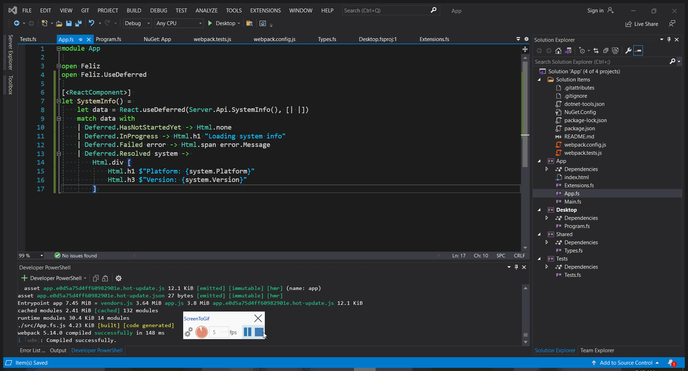

# Feliz on Desktop with Photino (Experimental)

Build a desktop application by embedding a small full stack F# web application in it with the help of [Photino](https://www.tryphotino.io).

Phontino hosts a lightweight chromium instance in a desktop window and this application embeds a full web application in it.

Using [Suave](https://github.com/SuaveIO/suave) as a mini embedded web server for the backend and [Feliz](https://github.com/Zaid-Ajaj/Feliz)/React on the frontend.

The frontend communicates with the backend via HTTP to access system APIs that are otherwise unavailable from the browser window.

The data transport between client and server is fully type-safe thanks to [Fable.Remoting](https://github.com/Zaid-Ajaj/Fable.Remoting)

Here is a gif of the application running during development. Notice how things like hot module reloading work out of the box so that we can edit the UI code and you see the changes immediately without having to reload the application.



> If you want, you could develop the application in the browser by simply navigating to `http://localhost:8080` but it's better to see how it looks like in the desktop window.

## Dependencies
The dependencies need are the .NET SDK (v5.0+) and Node.js (v12+)

When developing on Windows 10, the Edge Dev Channel version needs to be installed from [Microsoft Edge Insider](https://www.microsoftedgeinsider.com/en-us/download) to be able to view the browser

## Development

Before doing anything, start with installing npm dependencies into the client using `npm install`.

Then to start development mode with hot module reloading, run:
```bash
npm install  # Get dependencies used, like webpack
npm start
```
This will start the development server after compiling the project, once it is finished, navigate to http://localhost:8080 to view the application .

While the frontend is running, go the `./Desktop` and run the application in debug mode using
```
dotnet restore
dotnet run
```
This will do two things:
 - Runs a Suave backend in the background on port 5000 (API for the frontend)
 - Opens a Photino window navigating to localhost:8080 which is where the frontend is being hosted

## Build and package the application 

The `Build` project includes a couple of build targets to package up the application. 

```bash
cd ./Build
# windows
dotnet run -- build-win64
# linux
dotnet run -- build-linux64
# macOS
dotnet run -- build-osx64
```
You will find the application packaged inside the directory
```
Windows -> {root}/Desktop/bin/Release/net5.0/win10-x64/publish
Linux -> {root}/Desktop/bin/Release/net5.0/linux-x64/publish
MacOS -> {root}/Desktop/bin/Release/net5.0/osx-x64/publish
```
Feel free to extend the packaging function yourself:
```fs
let buildFor(runtime: Runtime) = 
    let releaseMode = Release
    Dotnet.Publish(desktop, [
        Dotnet.Configuration(releaseMode)
        Dotnet.Runtime(runtime)
        Dotnet.SelfContained()
        Dotnet.PublishSingleFile()
    ])
    Npm.Install(solutionRoot)
    Npm.Run("build", solutionRoot)
    let clientTarget = path [ desktop; "bin"; releaseMode.Format(); "net5.0"; runtime.Format(); "publish"; "wwwroot" ]
    Copy.DirectoryFrom(clientDist).To(clientTarget)

// Windows
buildFor(Runtime.Win10_x64)
// Linux
buildFor(Runtime.Linux_x64)
// macOS
buildFor(Runtime.Osx_x64)
```
